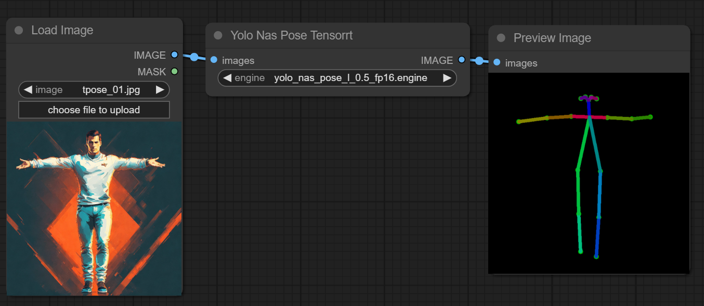

<div align="center">

# ComfyUI Yolo Nas Pose TensorRT

[](https://www.python.org/downloads/release/python-31012/)
[](https://developer.nvidia.com/cuda-downloads)
[](https://developer.nvidia.com/tensorrt)
[](https://creativecommons.org/licenses/by-nc-sa/4.0/deed.en)

</div>

<p align="center">
  
</p>

This project is licensed under [CC BY-NC-SA](https://creativecommons.org/licenses/by-nc-sa/4.0/), everyone is FREE to access, use, modify and redistribute with the same license.

For commercial purposes, please contact me directly at yuvraj108c@gmail.com

If you like the project, please give me a star! ⭐

---

This repo provides a ComfyUI Custom Node implementation of [YOLO-NAS-POSE](https://github.com/Deci-AI/super-gradients), powered by TensorRT for ultra fast pose estimation. It has been adapted to work with openpose controlnet (experimental)

## ⏱️ Performance

_The benchmarks were performed on 1225 frames_

| Device |      Model      | Precision | Model Input (WxH) | Image Resolution (WxH) | FPS |
| :----: | :-------------: | :-------: | :---------------: | :--------------------: | --- |
|  H100  | YOLO-NAS-POSE-L |   FP32    |      640x640      |        1280x720        | 105 |
|  H100  | YOLO-NAS-POSE-L |   FP16    |      640x640      |        1280x720        | 115 |

## 🚀 Installation

Navigate to the ComfyUI `/custom_nodes` directory

```bash
git clone https://github.com/yuvraj108c/ComfyUI-YoloNasPose-Tensorrt
cd ./ComfyUI-YoloNasPose-Tensorrt
pip install -r requirements.txt
```

## 🛠️ Building Tensorrt Engine

1. Download one of the available [onnx models](https://huggingface.co/yuvraj108c/yolo-nas-pose-onnx/tree/main). The number at the end represents the confidence threshold for pose detection _(e.g yolo_nas_pose_l_0.5.onnx)_
2. Edit model paths inside [export_trt.py](export_trt.py) accordingly and run `python export_trt.py`
3. Place the exported tensorrt engine inside ComfyUI `/models/tensorrt/yolo-nas-pose` directory

## ☀️ Usage

- Insert node by `Right Click -> tensorrt -> Yolo Nas Pose Tensorrt`
- Choose the appropriate engine from the dropdown

## 🤖 Environment tested

- Ubuntu 22.04 LTS, Cuda 12.4, Tensorrt 10.1.0, Python 3.10, H100 GPU
- Windows (Not tested, but should work)

## 👏 Credits

- [super-gradients -> yolo nas pose](https://github.com/Deci-AI/super-gradients)

## License

[Creative Commons Attribution-NonCommercial-ShareAlike 4.0 International (CC BY-NC-SA 4.0)](https://creativecommons.org/licenses/by-nc-sa/4.0/)
